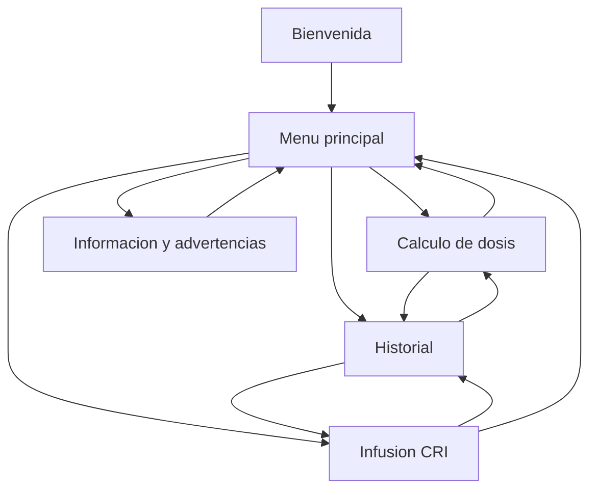

# Arquitectura propuesta para FarmaDosis

## 1. Lectura del SRS

FarmaDosis es una aplicacion movil multiplataforma para profesionales de enfermeria,
medicina y medicina veterinaria. Su objetivo es apoyar calculos farmacologicos basados
en peso, concentracion y presentacion del medicamento. La aplicacion debe funcionar sin
internet, responder rapido, validar entradas en tiempo real y mostrar advertencias
clinicas claras.

El SRS define cuatro bloques funcionales principales:

- Calculo de dosis normal.
- Calculo de infusion continua a ritmo constante, CRI.
- Historial de calculos de la sesion.
- Informacion y advertencias de seguridad.

Tambien exige que los calculos sean locales, rapidos, precisos, reutilizables desde el
historial y protegidos contra entradas incompletas o invalidas.

## 2. Decision tecnologica principal

La aplicacion debe desarrollarse en Ionic. La opcion recomendada es:

- Ionic Framework con Angular.
- Capacitor para empaquetar Android e iOS.
- TypeScript estricto.
- Angular standalone components.
- Reactive Forms tipados para formularios de calculo.
- Signals o servicios con estado simple para coordinacion local.
- Ionic Storage o Capacitor Preferences para persistencia local si luego se requiere
  mantener historial entre sesiones.

Para la primera version, el SRS pide historial "durante la sesion", asi que puede vivir en
memoria. Si el equipo decide conservar calculos al cerrar la app, se agrega persistencia
local sin cambiar la logica de dominio.

## 3. Estilo arquitectonico

Se recomienda una arquitectura modular por funcionalidades, con separacion clara entre:

- Presentacion: paginas Ionic, componentes y formularios.
- Aplicacion: facades/servicios que coordinan formularios, historial y navegacion.
- Dominio: funciones puras de calculo, modelos, validadores y formateadores.
- Infraestructura local: almacenamiento local, adaptadores de persistencia y utilidades
  de plataforma.

El punto mas importante es que las formulas no deben quedar dentro del HTML ni mezcladas
con componentes visuales. Deben estar en servicios o funciones puras testeables.

Para Angular moderno, la logica clinica debe vivir en `domain`, sin dependencias de
Angular ni Ionic. Las pantallas Ionic consumen esa logica mediante facades o servicios.

## 4. Modulos funcionales

### 4.1 Modulo de calculo de dosis

Responsabilidad:

- Recibir peso del paciente.
- Recibir dosis por kg.
- Permitir unidad mg/kg o ml/kg.
- Calcular dosis total.
- Permitir presentacion: sin presentacion, solucion o comprimidos.
- Calcular cantidad fisica a administrar cuando aplique.
- Mostrar instruccion final clara.

Formula base:

```text
dosisTotal = dosisPorKg * pesoKg
```

Para solucion:

```text
volumenMl = dosisTotal / concentracion
```

Para comprimidos:

```text
comprimidos = dosisTotal / concentracionMgPorComprimido
```

El resultado de comprimidos debe pasar por un formateador de fracciones legibles:
1/4, 1/2, 3/4, 1, 1 1/2, etc. La regla exacta debe definirse con el docente o experto,
porque redondear comprimidos tiene implicaciones clinicas.

### 4.2 Modulo CRI

Responsabilidad:

- Recibir peso del paciente.
- Recibir dosis en ug/kg o mg/kg.
- Recibir concentracion del vial.
- Recibir volumen de bolsa.
- Recibir cantidad de bolsas.
- Calcular flujo en ml/hora.
- Calcular volumen de medicamento a anadir a la bolsa.
- Indicar retiro del mismo volumen de suero.
- Calcular duracion de bolsa y tratamiento total.
- Generar instruccion de preparacion y administracion.

El SRS no especifica completamente todas las unidades necesarias para CRI, por ejemplo si
la dosis es por minuto, hora o dia. Antes de implementar la formula final se debe cerrar
esta definicion. Arquitectonicamente, el modulo debe soportar conversiones de unidades y
evitar calcular cuando falte una unidad critica.

### 4.3 Historial

Responsabilidad:

- Guardar automaticamente los ultimos calculos.
- Diferenciar calculos normales y CRI.
- Ver detalle.
- Reutilizar datos.
- Eliminar entradas individuales.

Modelo recomendado:

```ts
type CalculationKind = 'dose' | 'cri';

interface HistoryEntry<TInput, TResult> {
  id: string;
  kind: CalculationKind;
  createdAt: string;
  input: TInput;
  result: TResult;
  instruction: string;
}
```

### 4.4 Informacion y advertencias

Responsabilidad:

- Explicar el proposito de la app.
- Mostrar advertencia visible: la app no reemplaza criterio profesional.
- Recordar que todo resultado debe verificarse antes de administrar medicamentos.

Esta advertencia tambien debe aparecer cerca de los resultados, no solo en una pantalla
separada.

## 5. Estructura de carpetas recomendada

```text
src/
  app/
    domain/
      dose/
      cri/
      history/
    infrastructure/
      storage/
    features/
      home/
      dose-calculator/
        pages/
        components/
        services/
        models/
      cri-calculator/
        pages/
        components/
        services/
        models/
      history/
        pages/
        components/
        services/
        models/
      safety-info/
        pages/
    shared/
      components/
      pipes/
      directives/
      ui/
    app.routes.ts
    app.config.ts
  assets/
  environments/
```

Para una aplicacion pequena academica se podria simplificar, pero mantener `domain`,
`features`, `infrastructure` y `shared` evita que el proyecto crezca de forma desordenada.

## 6. Pantallas y navegacion

Flujo recomendado:



Rutas sugeridas:

```text
/welcome
/home
/dose
/cri
/history
/history/:id
/safety
```

Si la aplicacion debe abrir rapido y ser directa para usuarios clinicos, se puede omitir
la bienvenida despues del primer uso y abrir directamente en `/home`.

Las rutas deben cargarse de forma diferida con `loadComponent` para mantener bajo el
costo inicial de arranque.

## 7. Modelos de dominio

Modelos base sugeridos:

```ts
interface DoseInput {
  patientWeightKg: number;
  dosePerKg: number;
  doseUnit: 'mg/kg' | 'ml/kg';
  presentation: 'none' | 'solution' | 'tablet';
  concentration?: number;
  concentrationUnit?: 'mg/ml' | 'ml/ml' | 'mg/tablet';
}

interface DoseResult {
  totalDose: number;
  totalDoseUnit: 'mg' | 'ml';
  physicalAmount?: number;
  physicalAmountUnit?: 'ml' | 'tablet';
  displayAmount?: string;
  instruction: string;
}

interface CriInput {
  patientWeightKg: number;
  doseRate: number;
  doseRateUnit: 'ug/kg/min' | 'ug/kg/h' | 'mg/kg/h';
  vialConcentrationMgMl: number;
  bagVolumeMl: number;
  bagCount: number;
  infusionRateMlHour: number;
}

interface CriResult {
  drugRequiredMgHour: number;
  targetBagConcentrationMgMl: number;
  infusionRateMlHour: number;
  medicationVolumeMl: number;
  serumVolumeToRemoveMl: number;
  bagDurationHours: number;
  totalTreatmentDurationHours: number;
  instruction: string;
}
```

La implementacion inicial pide `infusionRateMlHour` porque RF20-RF24 no se pueden
resolver de forma segura solo con los datos originales del SRS. Esta decision debe
validarse con el tutor o experto clinico.

## 8. Validaciones

Validaciones obligatorias segun SRS:

- Campos numericos requeridos.
- Peso mayor a cero.
- Dosis mayor a cero.
- Concentracion mayor a cero cuando exista presentacion.
- No mostrar resultados si los datos estan incompletos o invalidos.
- Mensajes claros y cercanos al campo.

Validaciones adicionales recomendadas:

- Limitar rangos extremos con advertencia, no solo error.
- Normalizar decimales.
- Evitar division por cero.
- Confirmar unidades en cada resultado.
- Mostrar advertencia clinica antes de guardar o reutilizar calculos.

## 9. Herramientas necesarias

Desarrollo:

- Node.js LTS.
- Ionic CLI.
- Angular CLI.
- Capacitor CLI.
- Android Studio para compilar y probar Android.
- Xcode si se necesita iOS en macOS.
- Visual Studio Code.

Librerias:

- `@ionic/angular`
- `@capacitor/core`
- `@capacitor/android`
- `@capacitor/ios`
- `@ionic/storage-angular` o `@capacitor/preferences` si se persiste historial.
- `uuid` o `crypto.randomUUID()` para identificadores.

Calidad:

- ESLint.
- Prettier.
- Karma/Jasmine o Vitest para pruebas unitarias.
- Playwright o Cypress para pruebas end-to-end.
- GitHub Actions para validacion automatica.

## 10. Pruebas recomendadas

Unitarias:

- Formula de dosis total.
- Calculo de solucion.
- Calculo de comprimidos y fracciones.
- Redondeo a maximo dos decimales.
- Validadores numericos.
- Historial: agregar, reutilizar y eliminar.

Integracion:

- Formulario de dosis recalcula en tiempo real.
- Formulario CRI bloquea resultados invalidos.
- Reutilizar historial precarga el formulario correcto.

E2E:

- Usuario calcula dosis normal y guarda historial.
- Usuario calcula CRI y ve instrucciones.
- Usuario elimina un registro del historial.
- Usuario navega a informacion y vuelve al menu.

## 11. Riesgos y decisiones pendientes

- La formula CRI requiere precision adicional de unidades temporales: ug/kg/min,
  ug/kg/h, mg/kg/h, etc. El SRS actual solo dice ug/kg o mg/kg. La base inicial
  agrega unidad temporal y velocidad de infusion para evitar una formula ambigua.
- El redondeo de comprimidos debe validarse con criterio clinico.
- Se debe definir si el historial es solo de sesion o persistente entre cierres.
- No se deben almacenar datos personales de pacientes si no es necesario.
- La app debe dejar claro que es una herramienta de apoyo, no una prescripcion medica.

## 12. Orden de implementacion sugerido

1. Crear proyecto Ionic Angular con TypeScript estricto.
2. Configurar rutas principales.
3. Implementar modelos y funciones puras de calculo de dosis.
4. Implementar pantalla de dosis con Reactive Forms.
5. Implementar servicio de historial en memoria.
6. Implementar calculo CRI despues de confirmar unidades.
7. Agregar pantalla de historial y reutilizacion.
8. Agregar pantalla de informacion y advertencias.
9. Agregar pruebas unitarias de formulas y validaciones.
10. Probar en navegador, Android Emulator y dispositivo fisico.

## 13. Trazabilidad inicial RF/RNF

| Requisito | Estado | Implementacion inicial |
| --- | --- | --- |
| RF1-RF6 | Cubierto | Formulario y dominio de dosis normal. |
| RF7-RF14 | Parcial | Solucion y comprimidos implementados; redondeo de comprimidos requiere aprobacion clinica. |
| RF15-RF25 | Parcial | Pantalla y dominio CRI inicial; se agregan unidad temporal y velocidad de infusion por ambiguedad del SRS. |
| RF26-RF30 | Parcial | Historial en memoria con diferenciacion y eliminacion; falta reutilizacion de calculos. |
| RF31-RF35 | Parcial | Validaciones base en formularios y dominio; falta componente visual reutilizable para errores. |
| RF36 | Cubierto | Advertencia profesional en resultados y pantalla de seguridad. |
| RNF1-RNF2 | Pendiente de medicion | Funciones puras locales; falta benchmark/prueba. |
| RNF3-RNF4 | Pendiente de medicion | Bundle y app inicial; falta medicion en dispositivo/emulador. |
| RNF5-RNF6 | Parcial | UI Ionic responsiva inicial; falta refinamiento visual y accesibilidad. |
| RNF7 | Cubierto | Sin backend ni llamadas de red. |
| RNF8-RNF11 | Parcial | Validaciones y bloqueo de resultados invalidos; falta cobertura de pruebas. |
| RNF12 | Cubierto | Rutas simples: home, dose, cri, history, safety. |
